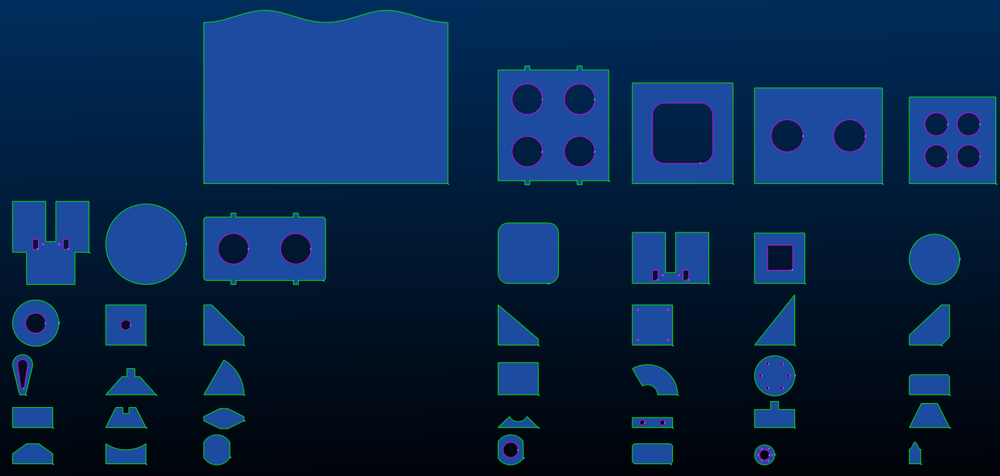
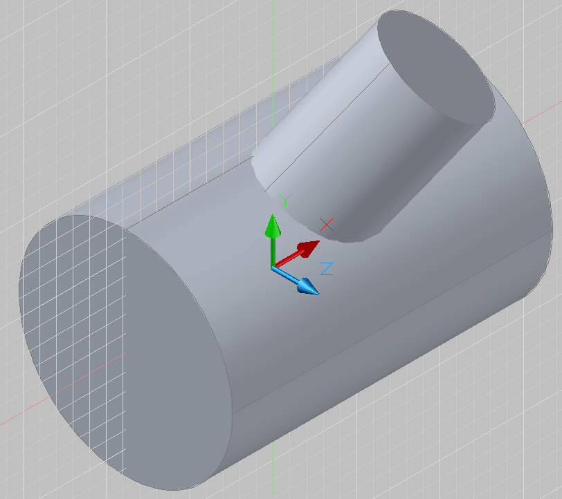
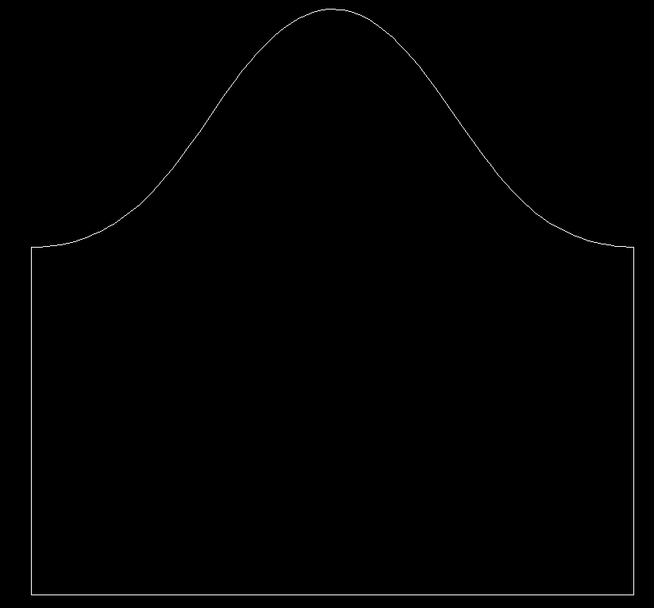
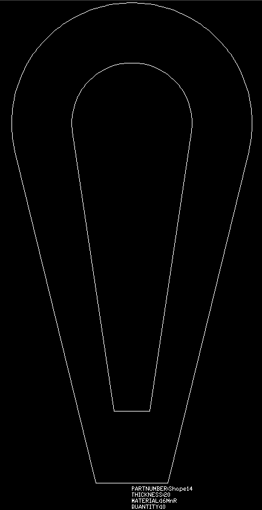
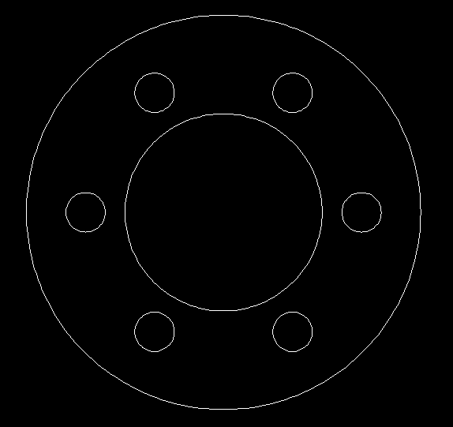
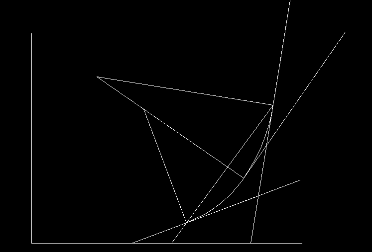

# DXFOperator
This Project is to write AutoCAD DXF file  without AutoCAD environment.It is my first java exercise. 

It services for enterprise designing tasks, such as lofting, nesting ..... 

Main File: FileDXF.java 
           FileDXFTest.java

EntArcTest 
EntBase 
	EntArc 
	EntCircle 
	EntLine 
	EntPoint 
	EntPolyline 
	EntText 
	EntVertex 
EntBaseTest 
EntCircleTest 
EntLineTest 
EntPointTest 
EntPolylineTest 
EntTextTest 
EntVertexTest 
FileDXF 
FileDXFTest 
SecBlocks 
SecBlocksTest 
SecClasses 
SecClassesTest 
SecEntities 
SecEntitiesTest 
SecHeader 
SecHeaderTest 
SecObjects 
SecObjectsTest 
SecTables 
SecTablesTest 
wPoint 
wPoint2D 
wPoint2DTest 
wPointTest 

Easy to use:
		FileDXF myFileDXF = new FileDXF();
		
		myFileDXF.AddPoint(2,2);
		myFileDXF.AddPoint(3,3,0);
		myFileDXF.AddLine(0,-80,300,-80);
		myFileDXF.AddLine(0,-80,0,300,-80,0);
		myFileDXF.AddCircle(0,0,80);
		myFileDXF.AddCircle(0,0,0,80);

		/*
		Others:
		myFileDXF.AddArc(0,0,90,0,90);
		myFileDXF.AddArc(0,0,0,90,0,90);
		myFileDXF.AddText(0,0,8,"Test");
		myFileDXF.AddText(0,0,0,8,"Test\r\nline 2");
		
		double[][] mypoints = {{0,0},{5,5},{10,8}};		
		myFileDXF.AddPolyline(mypoints);
		*/
		

		myFileDXF.DXF_WRITER();

Then create one DXF file: loft_output_2019_01_03_08_39_06_0.dxf

SigmaNest Parts 

intersection of two Cylinders to expand 

intersection lines of Belted Pipe and straight pipe 

BiArc Curve Fittiing 

Other jobs:

1.BiArc Curve Fitting  -- DONE  
2.Geometry Lofting -- Completed two types  
3.Computer Geometry Base Class -- NOP 

*@author David Wu 

<809758521@qq.com> 

*@version 0.5
